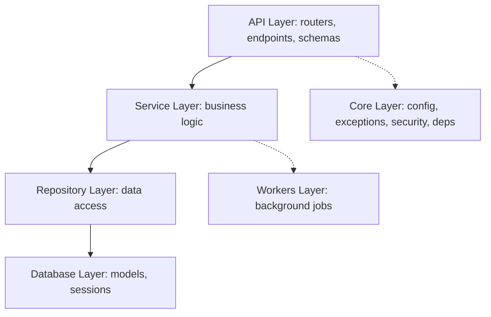

# Clean Architecture FastAPI Production Backend

This repository contains a production-ready, clean-architecture backend built with **FastAPI**, **PostgreSQL** (via **SQLAlchemy 2.0** & **asyncpg**), **Alembic**, and **Pydantic v2**. 

Designed for high-concurrency, scalability, and developer friendliness, the project leverages modern Python features like async endpoints, structured JSON logging, JWT-based security, dependency injection, and clean separation of concerns.

---

## Architecture Overview

This backend is organized into isolated layers to prevent leakage of concerns:



### Module Breakdown

| Directory | Responsibility |
| :--- | :--- |
| `app/api/` | Route handlers, path parameters, and request validation (Pydantic v2 schemas). |
| `app/core/` | Global configuration (`pydantic-settings`), custom authentication mechanisms, error handlers, and dependency injection providers. |
| `app/db/` | Connection pooling and transactional session lifecycles using SQLAlchemy's async driver. |
| `app/models/` | Declarative SQLAlchemy ORM models representing the physical database schema. |
| `app/schemas/` | Pydantic V2 serializers for strict input validation and clean outbound JSON formatting. |
| `app/services/` | Business rules, calculations, and orchestrations (invokes repositories, dispatches worker tasks). |
| `app/repositories/` | Raw database actions (CRUD statements, queries, filters) hiding SQL mechanics from services. |
| `app/workers/` | Offloaded background worker queues (implemented via FastAPI's native `BackgroundTasks`). |
| `app/utils/` | Shared stateless helpers and utilities. |
| `app/tests/` | Mock-enabled unit and integration test suite running on an async SQLite engine. |

---

## Features

- ⚡ **Asynchronous Stack**: End-to-end async implementation (`async def`) from route handlers down to database queries using `asyncpg`.
- 🔐 **JWT Authentication**: Robust authorization flows using custom password hashing (native `bcrypt`) and JWT sign/decode hooks.
- ⚙️ **Strict Config Validation**: Centralized environment variable loading validated by `pydantic-settings`.
- 📊 **Structured Logging**: Automatic JSON format outputs in production for seamless ingestion into ELK/Datadog, with human-readable colored streams in local environments.
- 💥 **Centralized Exceptions**: Global mapping of business errors (`NotFoundError`, `AuthenticationError`, `ConflictError`) into standardized API JSON structures.
- 🐳 **Docker-Ready**: Multi-stage `Dockerfile` and a local `docker-compose.yml` defining the API service and a PostgreSQL cluster.
- 🧪 **Async Testing Framework**: Complete testing configuration utilizing `pytest-asyncio`, `httpx.AsyncClient`, and in-memory async SQLite engine.

---

## Quick Start

### 1. Local Development Setup

Clone the project, copy the environment files, and start a virtual environment:

```bash
# Copy settings template
copy .env.example .env

# Create environment and install dependencies
python -m venv .venv
.venv\Scripts\activate
pip install -r requirements.txt
```

### 2. Run Database Migrations

Apply database updates via Alembic:

```bash
# Generate a new migration (if models change)
alembic revision --autogenerate -m "Initial schema"

# Apply migrations
alembic upgrade head
```

### 3. Start the Server

Launch the development server with auto-reload:

```bash
uvicorn app.main:app --reload
```
The application will be available at [http://localhost:8000](http://localhost:8000).

- **Interactive API docs (Swagger UI)**: [http://localhost:8000/docs](http://localhost:8000/docs)
- **Alternative API docs (ReDoc)**: [http://localhost:8000/redoc](http://localhost:8000/redoc)

---

## Running with Docker Compose

Spin up the entire application stack including the PostgreSQL database container:

```bash
docker-compose up --build
```

---

## Testing

Execute the automated test suite against an isolated, automatic async SQLite database:

```bash
pytest
```
